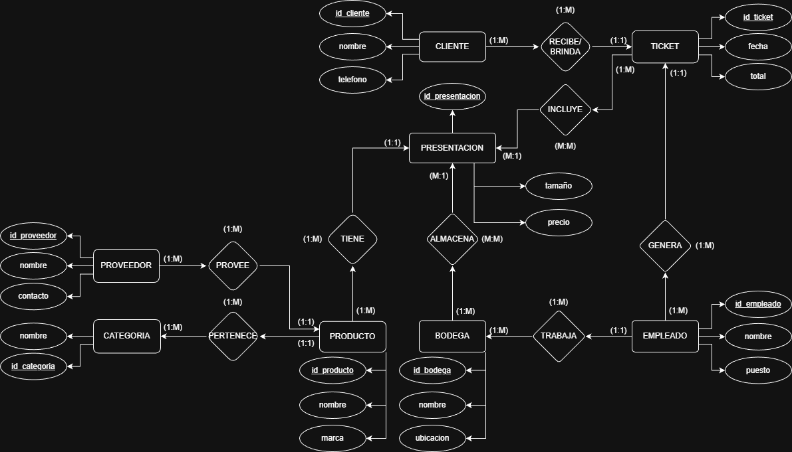
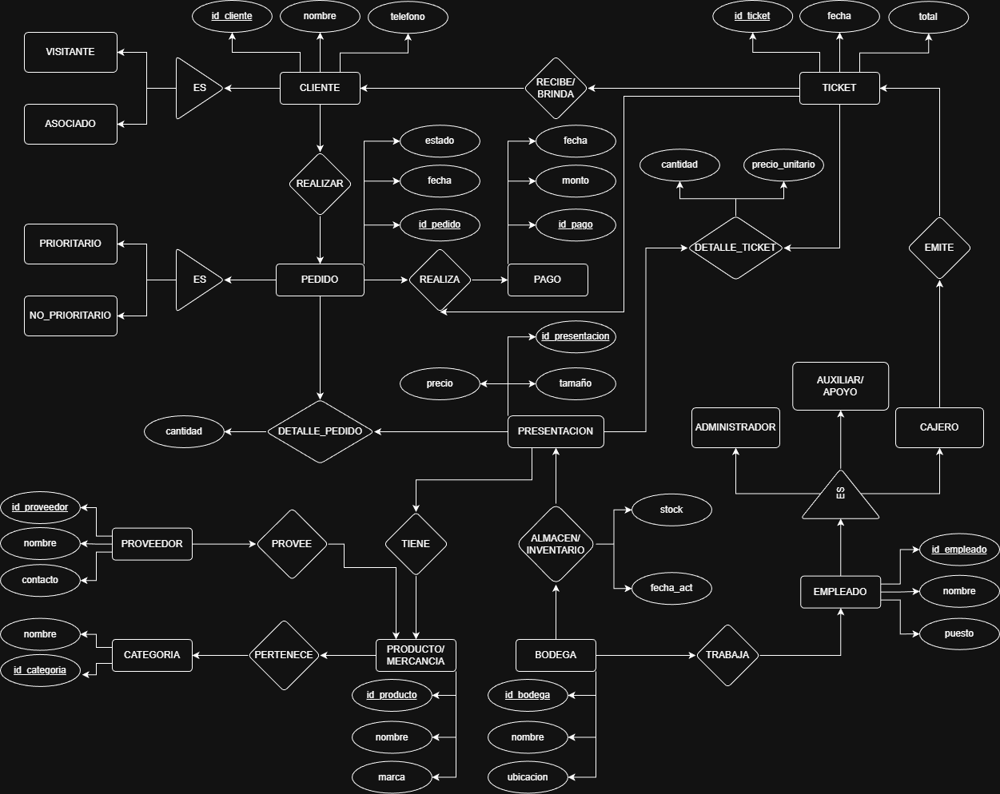
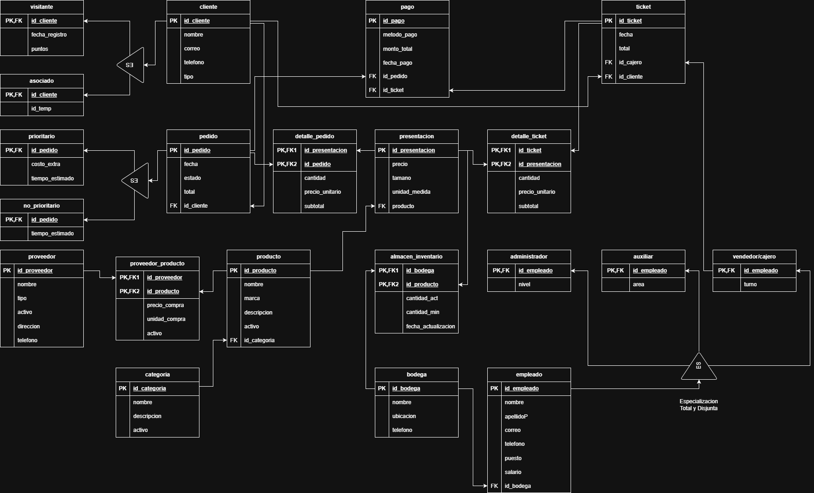

lo# 🏴‍☠️ Pirata Market – Sistema de Gestión de Abarrotes

Pirata Market es una aplicación web desarrollada en *Django* para la gestión integral de una cadena de abarrotes.  
Incluye catálogo público de productos, carrito de compras, sistema de pedidos, punto de venta (POS) para empleados, control de inventario y manejo de múltiples sucursales (bodegas).

El sistema está pensado para simular un entorno real de ventas tanto en línea como en tienda física.

---

## 🚀 Funcionalidades principales

### 🛒 Clientes
- Navegación pública del catálogo de productos
- Carrito de compras
- Generación de pedidos
- Pedidos asociados a una sucursal

### 🧑‍💼 Empleados
- Login seguro
- Dashboard administrativo
- Punto de Venta (POS)
- Gestión de inventario por bodega
- Visualización y control de pedidos
- Estados de pedido: pendiente, pagado, preparado, entregado y cancelado

### 📦 Inventario
- Control de stock por presentación
- Stock mínimo
- Ajustes manuales
- Descuento automático de inventario al cobrar pedidos o ventas

---

## 🛠️ Tecnologías utilizadas

- *Backend:* Django 5
- *Base de datos:* PostgreSQL (Supabase)
- *Frontend:* HTML5, CSS3, Django Templates
- *Autenticación:* Django Auth
- *Deploy:* Render
- *Control de versiones:* Git & GitHub

---

## 📊 Diagramas del sistema

### Diagrama ER Básico
Representa las entidades principales del sistema y sus relaciones generales.

---

### Diagrama ER Extendido
Incluye atributos, claves primarias, foráneas y relaciones detalladas
entre productos, pedidos, inventario, clientes y empleados.

---

### Diagrama Relacional – Base de Datos BodegaDB
Modelo relacional final utilizado para la implementación en PostgreSQL.

---

## 📸 Capturas del sistema

A continuación se muestran algunas capturas representativas de la interfaz y funcionalidades principales del sistema **Pirata Market**.

  
  
  
  

---

## 🔗 Enlaces importantes

- 📂 **Repositorio del proyecto:**  
  https://github.com/DarkMurr/proyectoBodegas

- 🌐 **Aplicación web (deploy en Render):**  
  https://pirata-market.onrender.com

- 📄 **Versión estática (GitHub Pages):**  
  https://darkmurr.github.io/proyectoBodegas/

---

## 🔐 Acceso de prueba (Panel de empleados)

Para fines de demostración y revisión del proyecto, se habilitó un usuario de prueba para acceder al panel de empleados, donde se puede visualizar el **POS**, **inventario**, **pedidos** y demás funcionalidades internas.

**Credenciales:**
- **Usuario:** `DarkMurr`
- **Contraseña:** `Escom1234`

📍 El acceso se realiza desde la opción **Login** en la barra de navegación o directamente en la ruta de inicio de sesión del sistema.

